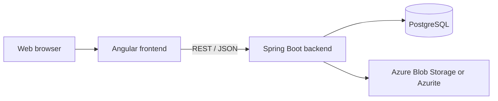

# [BugBoard26](https://bugboard26-frontend.icyisland-a27a4eea.italynorth.azurecontainerapps.io/)

BugBoard26 is a collaborative issue-tracking platform for software teams. It provides a shared workspace for reporting, assigning, prioritizing, tracking, and resolving issues throughout a project's lifecycle.

The application combines an Angular frontend with a Spring Boot REST API, PostgreSQL persistence, and Azure Blob Storage-compatible attachments.

## Features

- Project creation and member management
- Invitation-based user registration
- Role-based access for administrators, technical users, and external users
- Issue creation, assignment, status tracking, filtering, sorting, and pagination
- Project-specific tags and priorities
- File and image attachments
- CSV issue export
- Project activity reports
- Responsive interface for desktop and mobile devices
- JWT authentication through HTTP-only cookies
- Interactive OpenAPI documentation

## Architecture



| Layer                | Technologies                                                    |
| -------------------- | --------------------------------------------------------------- |
| Frontend             | Angular 21, TypeScript, RxJS, Bootstrap 5, SCSS                 |
| Backend              | Java 21, Spring Boot 4, Spring Security, Spring Data JPA        |
| Data                 | PostgreSQL 15, Hibernate                                        |
| Attachments          | Azure Blob Storage, Azurite for local development               |
| Testing              | JUnit 5, Mockito, H2, Vitest, JaCoCo                            |
| Delivery and quality | Docker/Podman, GitHub Actions, SonarQube Cloud, Microsoft Azure |

## Quick start

The simplest way to run the complete application is with Podman Compose or Docker Compose.

### Prerequisites

- [Git](https://git-scm.com/)
- [Podman](https://podman.io/) with Compose support, or Docker with Docker Compose
- OpenSSL, used to generate a secure JWT signing secret

On macOS, start the Podman virtual machine before launching the stack:

```bash
podman machine start
```

### 1. Clone the repository

```bash
git clone https://github.com/simoneparente/BugBoard26.git
cd BugBoard26
```

### 2. Create the environment file

```bash
cp .env.example .env
openssl rand -base64 48
```

Open `.env` and:

- replace `JWT_SECRET` with the generated value;
- choose secure PostgreSQL and seeded-user credentials;
- replace the placeholder Azure Storage values with a valid Azure Blob Storage or Azurite connection string.

When the backend runs inside the Compose network, an Azurite connection string must use `azurite:10000` as its Blob service endpoint. When the backend runs directly on the host, use the exposed endpoint at `127.0.0.1:10001`.

Never commit `.env` or any production credential.

### 3. Start the application

With Podman:

```bash
podman compose up -d --build
podman compose ps
```

With Docker:

```bash
docker compose up -d --build
docker compose ps
```

The first build may take a few minutes while the application images and dependencies are downloaded.

### 4. Open the services

| Service              | Address                                       |
| -------------------- | --------------------------------------------- |
| Web application      | <http://localhost:4200>                       |
| Backend API          | <http://localhost:8080/api>                   |
| Swagger UI           | <http://localhost:8080/swagger-ui/index.html> |
| OpenAPI document     | <http://localhost:8080/v3/api-docs>           |
| PostgreSQL           | `localhost:5432` by default                   |
| Azurite Blob service | `localhost:10001`                             |

The initial administrator account uses the `SEED_USERNAME` and `SEED_PASSWORD` values from `.env`.

### Stop the application

```bash
podman compose down
```

Docker users can run `docker compose down` instead. To remove the PostgreSQL and upload volumes as well, add `--volumes`; this permanently deletes local application data.

## Local development

For development outside containers, install:

- Java 21;
- Node.js 22 and npm;
- PostgreSQL 15, or run the `db` Compose service;
- Azure Blob Storage access, or run the `azurite` Compose service.

Start only the local infrastructure:

```bash
podman compose up -d db azurite
```

Export the required variables from `.env` in your terminal or IDE before starting the backend. At minimum, configure `JWT_SECRET`, `AZURE_STORAGE_CONNECTION_STRING`, and `AZURE_STORAGE_CONTAINER_NAME`.

### Backend

From the repository root:

```bash
./bugboard-backend/mvnw -f bugboard-backend/pom.xml spring-boot:run
```

The backend uses `localhost:5432` by default and starts on port `8080`.

### Frontend

In a separate terminal:

```bash
cd bugboard-frontend
npm ci
npm start
```

The Angular development server starts on port `4200` and proxies `/api` requests to `http://localhost:8080`.

## Configuration

The main environment variables are:

| Variable                          | Purpose                                         | Default or example         |
| --------------------------------- | ----------------------------------------------- | -------------------------- |
| `POSTGRES_DB`                     | PostgreSQL database name                        | `bugboard_db`              |
| `POSTGRES_USER`                   | PostgreSQL user                                 | `bugboard`                 |
| `POSTGRES_PASSWORD`               | PostgreSQL password                             | No safe production default |
| `POSTGRES_PORT`                   | Host PostgreSQL port                            | `5432`                     |
| `JWT_SECRET`                      | HS256 signing secret; must be at least 32 bytes | Required                   |
| `SEED_USERNAME`                   | Initial administrator username                  | `bugboard`                 |
| `SEED_EMAIL`                      | Initial administrator email                     | `bugboard@bugboard.it`     |
| `SEED_PASSWORD`                   | Initial administrator password                  | Change before shared use   |
| `AZURE_STORAGE_CONNECTION_STRING` | Azure Blob Storage or Azurite connection        | Required                   |
| `AZURE_STORAGE_CONTAINER_NAME`    | Attachment container                            | `attachments`              |
| `CORS_ALLOWED_ORIGINS`            | Comma-separated frontend origins                | `http://localhost:4200`    |
| `POSTGRES_SSLMODE`                | PostgreSQL SSL mode                             | `prefer` outside Compose   |

## Tests and quality checks

Run the backend test suite:

```bash
./bugboard-backend/mvnw -f bugboard-backend/pom.xml test
```

Run the frontend test suite:

```bash
cd bugboard-frontend
npm ci
npm test
```

Check or fix frontend formatting:

```bash
npm run format:check
npm run format:fix
```

Create production builds:

```bash
./bugboard-backend/mvnw -f bugboard-backend/pom.xml clean package
cd bugboard-frontend
npm ci
npm run build:prod
```

GitHub Actions checks frontend formatting, builds and analyzes the backend with SonarQube Cloud, and deploys the application to Azure from the main branch.

## Repository structure

```text
.
├── bugboard-backend/    Spring Boot REST API
├── bugboard-frontend/   Angular web application
├── db/                  PostgreSQL container configuration
├── setup/               Local and Azure helper scripts
├── .github/workflows/   CI, quality analysis, and deployment workflows
├── .env.example         Environment configuration template
└── docker-compose.yml   Complete local application stack
```

Additional operational commands are available in [`setup/README.md`](setup/README.md).

## Development workflow

Development uses short-lived feature and bug-fix branches:

- `main` contains stable releases;
- `development` is the integration branch;
- `feature/*` contains new features;
- `bug/*` and `fix/*` contain corrections.

Changes should be submitted through a pull request and reviewed before they are merged.

## Academic context

BugBoard26 was developed for the Software Engineering course in the 2025/2026 academic year.

- **University:** University of Naples Federico II
- **Department:** Department of Electrical Engineering and Information Technology (DIETI)
- **Degree programme:** Computer Science (L-31)
- **Professors:** P. Tramontana and B. Breve

### Team

- Simone Parente Martone — N86004297
- Mario Penna — N86003308
- Michela Pollio — N86003697
